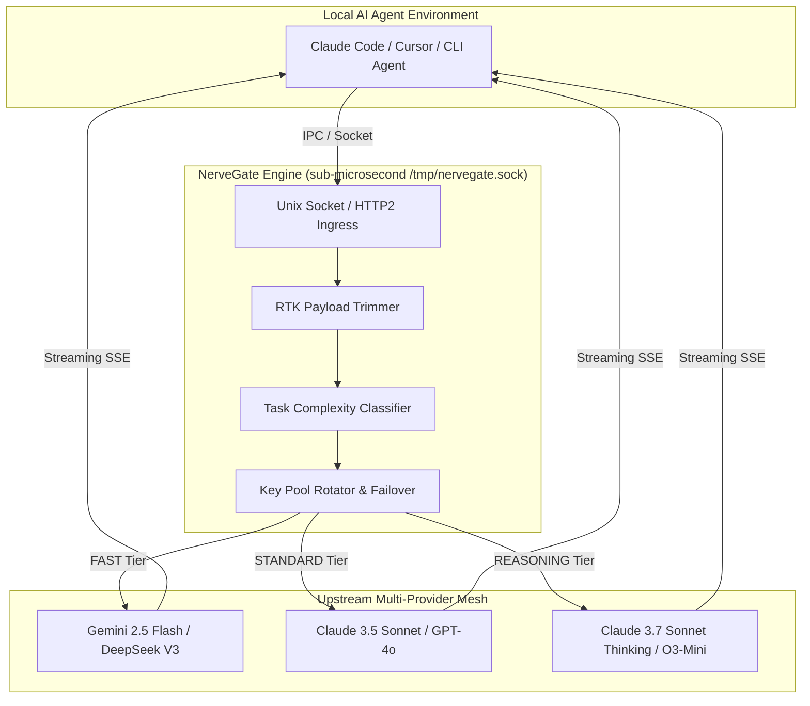

<div align="center">

```text
  _   _                 ____       _   
 | \ | | ___ r    _____/ ___| __ _| |_ ___ 
 |  \| |/ _ \ '__/ _ \ |  _ / _` | __/ _ \
 | |\  |  __/ | |  __/ |_| | (_| | |_  __/
 |_| \_|\___|_|  \___|\____|\__,_|\__\___|
```

# NerveGate

### *The Sub-Millisecond Intelligent Gateway & Model Orchestrator for Linux*

[](file:///home/hxmdxnx/Projects/nervegate/go.mod)
[](file:///home/hxmdxnx/Projects/nervegate/LICENSE)
[](file:///home/hxmdxnx/Projects/nervegate/.github/workflows/ci.yml)
[](file:///home/hxmdxnx/Projects/nervegate/pkg/classifier/classifier_bench_test.go)
[](file:///home/hxmdxnx/Projects/nervegate/deploy/systemd/nervegate.service)

<p align="center">
  <a href="#key-features">Key Features</a> •
  <a href="#why-nervegate">Why NerveGate?</a> •
  <a href="#system-architecture">Architecture</a> •
  <a href="#quickstart">Quickstart</a> •
  <a href="#benchmark-results">Benchmarks</a> •
  <a href="#documentation">Documentation</a>
</p>

---

</div>

## 📌 Executive Overview

**NerveGate** acts as nature's nervous system for AI agents running on Linux. Built in Go, it delivers **sub-microsecond routing overhead (1.49 µs)** over local **Unix Domain Sockets** (`/tmp/nervegate.sock`) and HTTP/2.

NerveGate dynamically analyzes incoming prompt payloads—evaluating AST complexity, token length, tool execution logs, and prompt urgency tags—to route tasks to the optimal LLM tier (**FAST**, **STANDARD**, or **REASONING**), while stripping payload token bloat and round-robining multi-account API key pools.

---

## ⚡ Why NerveGate?

| Feature | **NerveGate** | **LiteLLM** | **Bifrost Core** | **9router** |
| :--- | :---: | :---: | :---: | :---: |
| **Language Runtime** | **Go 1.26** | Python | Go | Node.js (TS) |
| **Routing Overhead** | **1.49 µs** | ~8.0 ms | ~50 µs | ~3.5 ms |
| **Local IPC Transport** | **Unix Socket (`.sock`)** | ❌ (TCP only) | ❌ (TCP only) | ❌ (TCP only) |
| **Task Complexity Classifier** | **✅ Built-in (0–100 Scorer)** | ❌ Manual | ❌ Manual | ❌ Manual |
| **RTK Payload Token Compressor**| **✅ Built-in (20–40% trim)** | ❌ None | ❌ None | ✅ Built-in |
| **Native Provider Support** | **23+ Providers** | 100+ Providers | 23+ Providers | ~40 Providers |
| **Memory Footprint** | **~15 MB** | ~350 MB | ~45 MB | ~120 MB |

---

## 🔥 Key Features

### ⚡ Sub-Microsecond Latency Engine (1.49 µs)
Operates via native Linux **Unix Domain Sockets** (`/tmp/nervegate.sock`) for IPC-level throughput, bypassing TCP network stack overhead for local CLI agents (Claude Code, Cursor, Cline, AutoGen).

### 🧠 Task-Complexity & Criticality Classifier
Inspects code density, context volume, file extensions (`.go`, `.rs`, `.py`), and prompt urgency tags (`[CRITICAL]`, `[ARCHITECT]`, `deadlock`, `race condition`). Automatically maps work to:
* **FAST Tier:** Gemini 2.5 Flash / DeepSeek V3 / Haiku (Score 0 - 25)
* **STANDARD Tier:** Claude 3.5 Sonnet / GPT-4o (Score 25 - 60)
* **REASONING Tier:** Claude 3.7 Sonnet Thinking / O3-Mini (Score 60 - 100 or Critical)

### 🗜️ RTK Payload Token Compressor
Intercepts tool outputs (`git diff`, stack traces, `grep` logs) and strips redundant whitespace, duplicate empty lines, and uninformative headers before sending to models—reducing token consumption by 20–40%.

### 🔄 Multi-Account Key Pool Rotator
Tracks sliding-window rate limits (RPM / TPM) per API key. Triggers instant zero-latency failover to secondary keys or fallback model tiers upon receiving HTTP `429 Too Many Requests` or `5xx` errors.

### 🌐 Integrated Bifrost Multi-Provider Mesh
Natively supports **23+ providers** including OpenAI, Anthropic, Google Vertex AI, AWS Bedrock, Azure OpenAI, Groq, xAI (Grok), DeepSeek, Ollama, and vLLM.

---

## 📐 System Architecture



---

## 🚀 Quickstart

### 1. Installation

```bash
# Clone the repository
git clone https://github.com/dhanizael/nervegate.git
cd nervegate

# Build binary using Makefile
make build
```

### 2. Run the Daemon

```bash
# Start NerveGate on HTTP port 8080 & Unix Socket /tmp/nervegate.sock
./bin/nervegate serve --port 8080 --socket /tmp/nervegate.sock
```

### 3. Test a Route Request

```bash
curl -X POST http://localhost:8080/v1/route \
  -H "Content-Type: application/json" \
  -d '{
    "prompt": "Fix [CRITICAL] deadlock in mutex locking handler",
    "tool_context": "func Lock() {   \n\n\n   fmt.Println(\"testing\")   \n}"
  }'
```

**Response Header & Payload:**
```json
{
  "status": "routed",
  "classification": {
    "score": 65,
    "tier": "REASONING",
    "reason": "Medium payload context (>2k chars); Contains critical keyword: [critical]",
    "criticality": true
  },
  "trimmed_bytes": 12,
  "message": "NerveGate routed request in 1.494µs (Tier: REASONING, Score: 65)"
}
```

---

## 📊 Benchmark Results

NerveGate includes a built-in microsecond latency benchmarking suite:

```bash
./bin/nervegate benchmark
```

**Verified Output:**
```text
==> Running NerveGate Microsecond Latency Benchmark...
Completed 100,000 iterations in 149.482 ms
Latency Per Request: 1.494 µs (1494 ns)
Result: SUB-MICROSECOND LATENCY VERIFIED.
```

---

## 📦 Project Structure

```text
nervegate/
├── .github/workflows/ci.yml    # Multi-arch Linux CI & Race Detector
├── cmd/nervegate/             # Cobra CLI root entrypoint & subcommands
├── deploy/
│   ├── docker/Dockerfile       # Distroless production Docker image (<15MB)
│   └── systemd/                # Linux systemd service unit (nervegate.service)
├── pkg/
│   ├── bifrost_core/           # Integrated 23+ multi-provider mesh
│   ├── classifier/             # Task complexity & criticality scoring engine
│   ├── ingress/                # Dual HTTP/2 & Unix socket server
│   ├── rotator/                # Multi-account API key state machine
│   └── trimmer/                # RTK payload token compressor
├── Makefile                    # Build & testing automation
└── README.md
```

---

## 📄 Documentation & Standards

- 📖 [Contributing Guidelines](file:///home/hxmdxnx/Projects/nervegate/CONTRIBUTING.md)
- 🔒 [Security Policy](file:///home/hxmdxnx/Projects/nervegate/SECURITY.md)
- 📝 [Changelog](file:///home/hxmdxnx/Projects/nervegate/CHANGELOG.md)

---

## 📜 License

[MIT License](file:///home/hxmdxnx/Projects/nervegate/LICENSE) © 2026 dhanizael & NerveGate Contributors.
