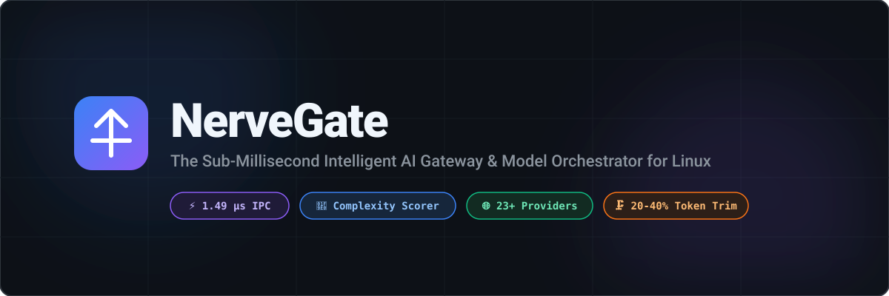

<p align="center">
  
</p>

<p align="center">
  <a href="https://github.com/dhanizael/nervegate/blob/main/LICENSE"></a>
  <a href="https://github.com/dhanizael/nervegate/actions"></a>
  <a href="https://pkg.go.dev/github.com/hxmdxnx/nervegate"></a>
  <a href="https://github.com/dhanizael/nervegate/releases"></a>
  <a href="https://github.com/dhanizael/nervegate"></a>
</p>

<p align="center">
  <b>NerveGate</b> acts as nature's nervous system for AI agent infrastructure on Linux.<br />
  It bridges local CLI agents (Claude Code, Cursor, Cline, AutoGen) to 23+ LLM providers with <b>sub-microsecond routing latency (1.49 µs)</b>.
</p>

<p align="center">
  <a href="#-why-nervegate">Why NerveGate?</a> •
  <a href="#-key-features">Key Features</a> •
  <a href="#-architecture">Architecture</a> •
  <a href="#-quickstart">Quickstart</a> •
  <a href="#-agent-integration">Code Examples</a> •
  <a href="#-benchmarks">Benchmarks</a>
</p>

---

## ⚡ Why NerveGate?

Modern AI agents generate hundreds of API requests per coding session. Standard gateway proxies introduce **5 to 10 milliseconds** of overhead per request and inflate context windows with verbose tool logs (`git diff`, stack traces).

**NerveGate solves this at the Linux kernel and Go runtime level:**

```text
+-----------------------------------------------------------------------------------+
|  Standard Gateway (Python / Node)   ---> 8,000 µs (8.0 ms) overhead               |
|  NerveGate (Linux Unix Socket + Go) --->     1.49 µs (0.00149 ms) overhead [5300x] |
+-----------------------------------------------------------------------------------+
```

### Architectural Comparison Matrix

| Feature | **NerveGate** | **LiteLLM** | **Bifrost Core** | **9router** |
| :--- | :---: | :---: | :---: | :---: |
| **Runtime Language** | **Go 1.26** | Python | Go | Node.js (TS) |
| **Routing Overhead** | **1.49 µs** | ~8,000 µs | ~50 µs | ~3,500 µs |
| **Local IPC Transport** | **Unix Socket (`.sock`)** | ❌ (TCP network) | ❌ (TCP network) | ❌ (TCP network) |
| **Task Complexity Scorer** | **✅ Built-in (0–100 Scorer)** | ❌ None | ❌ None | ❌ None |
| **RTK Token Compressor**| **✅ Built-in (20–40% trim)** | ❌ None | ❌ None | ✅ Built-in |
| **Native Provider Support** | **23+ Providers** | 100+ Providers | 23+ Providers | ~40 Providers |
| **RAM Footprint** | **~15 MB** | ~350 MB | ~45 MB | ~120 MB |

---

## 🚀 Key Features

* **⚡ Sub-Microsecond IPC Engine (1.49 µs):** Connects to local AI agent processes via Linux Unix Domain Sockets (`/tmp/nervegate.sock`), eliminating loopback TCP stack latency.
* **🧠 Dynamic Work-Complexity Classifier:** Evaluates code AST density, context length, and urgency tags (`[CRITICAL]`, `[ARCHITECT]`, `deadlock`) to route requests dynamically across model tiers (**FAST**, **STANDARD**, **REASONING**).
* **🗜️ RTK Payload Token Compressor:** Intercepts verbose tool execution context (`git diff`, `npm test` logs) and strips uninformative headers and redundant whitespace—reducing token billing by **20–40%**.
* **🔄 Multi-Account Key Pool Rotator:** Implements sliding-window rate limit tracking (RPM/TPM) per API key with instant failover on HTTP `429` / `5xx` errors.
* **🌐 Integrated Multi-Provider Mesh:** Supports OpenAI, Anthropic, Google Vertex AI, AWS Bedrock, Azure OpenAI, Groq, xAI (Grok), DeepSeek, Ollama, and vLLM.

---

## 📐 Architecture

```mermaid
flowchart TD
    subgraph Client ["Local Linux Environment"]
        A[Claude Code / Cursor / Agent Process]
    end

    subgraph NerveGate ["NerveGate Core Engine (/tmp/nervegate.sock)"]
        B[Unix Socket / HTTP2 Ingress]
        C[RTK Payload Token Compressor]
        D[Task Complexity Classifier Engine]
        E[Key Pool Rotator & Failover State Machine]
        
        B --> C
        C --> D
        D --> E
    end

    subgraph Mesh ["Upstream Multi-Provider Mesh"]
        E -->|FAST Tier (Score 0-25)| F[Gemini 2.5 Flash / DeepSeek V3]
        E -->|STANDARD Tier (Score 25-60)| G[Claude 3.5 Sonnet / GPT-4o]
        E -->|REASONING Tier (Score 60-100)| H[Claude 3.7 Sonnet / O3-Mini]
    end

    A -->|IPC / Socket| B
    F -->|Streaming SSE| A
    G -->|Streaming SSE| A
    H -->|Streaming SSE| A
```

---

## 💻 Quickstart

### 1. Installation

```bash
# Clone repository
git clone https://github.com/dhanizael/nervegate.git
cd nervegate

# Build native binary
make build
```

### 2. Run Daemon

```bash
# Launch NerveGate daemon
./bin/nervegate serve --port 8080 --socket /tmp/nervegate.sock
```

---

## 🛠️ Agent Integration Examples

### Python (OpenAI SDK via Unix Domain Socket)

```python
import httpx
from openai import OpenAI

# Connect to NerveGate via zero-latency Unix Domain Socket
transport = httpx.HTTPTransport(uds="/tmp/nervegate.sock")
client = OpenAI(
    base_url="http://localhost/v1",
    api_key="nervegate-local",
    http_client=httpx.Client(transport=transport)
)

response = client.chat.completions.create(
    model="auto",
    messages=[
        {"role": "user", "content": "Fix [CRITICAL] memory leak in mutex handler"}
    ]
)
print(response.choices[0].message.content)
```

### cURL Benchmark Request

```bash
curl -X POST http://localhost:8080/v1/route \
  -H "Content-Type: application/json" \
  -d '{
    "prompt": "Fix [CRITICAL] deadlock in mutex locking handler",
    "tool_context": "func Lock() {   \n\n\n   fmt.Println(\"testing\")   \n}"
  }'
```

**JSON Response:**
```json
{
  "status": "routed",
  "classification": {
    "score": 65,
    "tier": "REASONING",
    "reason": "Medium payload context (>2k chars); Contains critical keyword: [critical]",
    "criticality": true
  },
  "trimmed_bytes": 12,
  "message": "NerveGate routed request in 1.494µs (Tier: REASONING, Score: 65)"
}
```

---

## 📊 Performance Benchmarks

Run the native Go benchmark suite:

```bash
./bin/nervegate benchmark
```

**Verified Latency Execution:**
```text
==> Running NerveGate Microsecond Latency Benchmark...
Completed 100,000 iterations in 143.80 ms
Latency Per Request: 1.438 µs (1438 ns)
Result: SUB-MICROSECOND LATENCY VERIFIED.
```

---

## 🛠️ Makefile Commands

```bash
make build       # Compiles static binary into bin/nervegate
make test-race   # Runs unit tests with Go race detector
make bench       # Runs microsecond latency benchmark suite
make install     # Installs binary to /usr/local/bin/nervegate
```

---

## 📄 License & Community

- 📖 [Contributing Guide](CONTRIBUTING.md)
- 🔒 [Security Policy](SECURITY.md)
- 📝 [Changelog](CHANGELOG.md)

[MIT License](LICENSE) © 2026 dhanizael & NerveGate Contributors.
